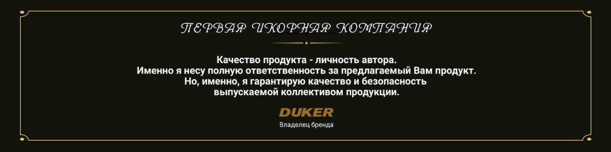

На сегодняшний день имитированная икра приобретает все большую популярность, как на Украинском, так и на Европейском рынках.

###### Связано это:

*   с ценой на имитированную икру ( ниже на 80% )
*   с усовершенствованием качества икры, которое практически ничем не отличается от натуральной.

###### Компания предлагает усовершенствованный продукт Европейского качества, икра.

*   «Кета», «Горбуша», «Форель»
*   «Белуга», «Осетр»
*   «Щука»

Гарантированное качество.

Наличие аккредитованной  лаборатории, дает нам возможность внедрения собственных технологий при разработке новейших видов имитированной икры, особенно важно, обеспечить строжайший входной контроль сырья поступающего на производство и контроль качества готовой продукции. 
Что подтверждается наличием сертификата ISO 22 000 (НАССР).
Наша лаборатория первая в Европе создала икру (с глазком) т.е. полный аналог натуральной икры и запатентовала способ производства в соответствии с законодательством Украины под торговой марков "VIP DUKER"

Икра произведена на уникальном оборудовании по запатентованным  (сложным, многостадийным) технологиям с использованием натурального сырья.

В результате – продукт по своим свойствам и качеству ничем не отличается от натуральной икры.

  

Производство продукции осуществляется новым предприятием Европейского уровня.

Молодая команда специалистов во главе с Генеральным директором работала и продолжает работать над усовершенствованием технологий по производству имитированной икры.

9 патентов компании даёт нам возможность полностью обеспечить потребность Украины и Европы качественной продукции.
