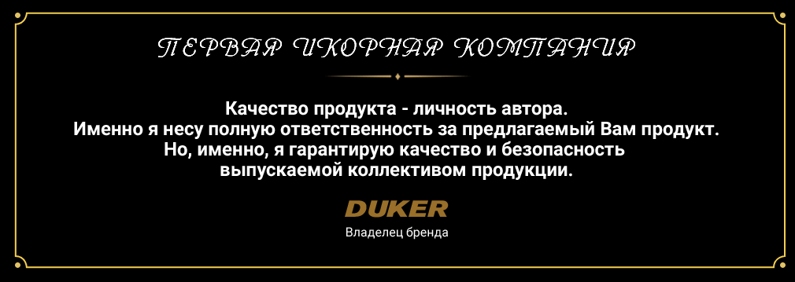

На сьогоднішній день продукт набуває все більшої популярності, як на Українському, так і на Європейському ринках.

###### Пов'язано це:

* З ціною на імітовану ікру (нижче на 80%)
* З удосконаленням якості ікри, яке практично нічим не відрізняється від натуральної.

###### Компанія пропонує вдосконалений продукт Європейського якості:

* «Кети», «горбуша», «Форель»
* «Білуги», «Осетрова»
* «Щуки»

Гарантоване якість.

Наявність акредитованої лабораторії дає нам можливість впровадження власних технологій при розробці нових видів імітованої ікри, і, що власне важливо, забезпечити суворий вхідний контроль сировини що надходить на виробництво і контроль якості готової продукції.

###### Наявність сертифіката ISO 22 000 (НАССР) не що інше, як підтвердження торговими марками:

* Перша Ікорна Компанія ™
* VIP DUKER ™

Імітована ікра виготовлена ​​технологами на унікальному обладнанні по запатентованим (складному, багатостадійним) технологіями з використанням натуральної сировини.

В результаті - продукт за своїми властивостями і якістю повторює (імітує) натуральну ікру.

  

Виробництво продукції здійснюється новим підприємством європейського рівня.

Молода команда фахівців на чолі з Генеральним директором працювала і продовжує працювати над удосконаленням наявних технологій з виробництва імітованої ікри.

Підприємство працює по запатентованим технологіям і на унікальному запатентованому устаткуванні.

Компанія має 6 патнтов (4 - патенту за технологією і 2 - патенту на обладнання)
